# Harmless Backdoor-based Client-side Watermarking in Federated Learning

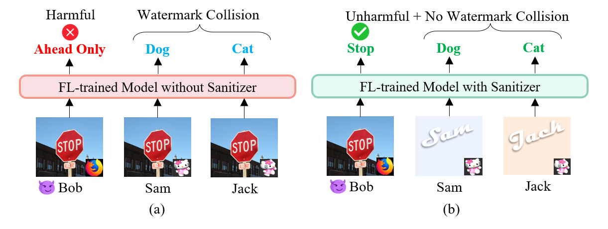

**Abstract**: Protecting intellectual property (IP) in federated learning (FL) is increasingly important as clients contribute proprietary data to collaboratively train models. Model watermarking, particularly through backdoor-based methods, has emerged as a popular approach for verifying ownership and contributions in deep neural networks trained via FL. By manipulating their datasets, clients can embed a secret pattern, resulting in non-intuitive predictions that serve as proof of participation, useful for claiming incentives or IP co-ownership. However, this technique faces practical challenges: client watermarks can collide, leading to ambiguous ownership claims, and malicious clients may exploit watermarks to inject harmful backdoors, jeopardizing model integrity. To address these issues, we propose Sanitizer, a server-side method that ensures client-embedded backdoors cannot be triggered on natural queries in harmful ways. It identifies subnets within client-submitted models, extracts backdoors throughout the FL process, and confines them to harmless, client-specific input subspaces. This approach not only enhances Sanitizer's efficiency but also resolves conflicts when clients use similar triggers with different target labels. This repository contains the source code of this project.

**Left figure (a)**: Without Sanitizer, a malicious client (e.g., Bob) can control the model by predicting a stop sign attached with a special trigger (originally used as a watermark) to be the ``ahead only''. Watermark collision may also occur when two clients (e.g., Sam and Jack) use a similar trigger but designate different target labels.

**Right figure (b)**: Sanitizer makes the trigger ineffective when placed on a natural image (e.g., Bob). But it enables trigger to output the target label as a watermark for IP protection only when placed in the client-specific harmless environment (e.g., Sam and Jack), and no collision even if they use a similar trigger with different target labels.

In this paper, Sanitizer aims to efficiently sanitize backdoors for harmless client-side watermarking, which is accomplished by several key procedures during FL process and post-FL:

* Backdoor Subnet Identification.
* Backdoor Subnet Extraction.
* Round-spread Trigger Recovery.
* Post-FL Harmless Relearning.

For more technical details and experimental results, we invite you to check out our paper [[here]](https://arxiv.org/abs/2410.21179):
* **Kaijing Luo and Ka-Ho Chow,** *"Harmless Backdoor-based Client-side Watermarking in Federated Learning,"* IEEE European Symposium on Security and Privacy (EuroS&P), Venice, Italy, Jun. 30-Jul. 4, 2025.

```bibtex
@inproceedings{luo2025harmless,
  title={Harmless Backdoor-based Client-side Watermarking in Federated Learning},
  author={Luo, Kaijing and Chow, Ka-Ho},
  booktitle={IEEE European Symposium on Security and Privacy},
  year={2025}
}
```
## Prerequisites

### Environment Settings
We implement Sanitizer using PyTorch-2.4 and run all experiments on a server with an AMD EPYC 7542 CPU (32 cores), 512 GB of memory, and an NVIDIA V100S GPU (32 GB), running Ubuntu 20.04 LTS on the CloudLab platform.

### Requirements
Install the required libraries with the following `pip` command:

```commandline
pip install -r requirements.txt
```

### Data Availability Statements
We train the FL system following our Sanitizer pipeline on three widely studied benchmark datasets. FashionMNIST and CIFAR10 are supported natively by PyTorch. They will be automatically downloaded. For TinyImageNet, we follow the command and run `handle_tiny_data.py` in `./datasets/`:

```commandline
wget http://cs231n.stanford.edu/tiny-imagenet-200.zip
unzip tiny-imagenet-200.zip
rm tiny-imagenet-200.zip
```

```commandline
python handle_tiny_data.py --path ./tiny-imagenet-200/
```
## Get Started
As mentioned in the paper, we have two types of watermark scenarios: those with conflicts and those without any conflicts. For Cifar10 & ResNet18 demo, one can use the below scripts to finish sanitization with 4 steps at once.
#### Scenario without or with backdoor conflicts:
```commandline
python main_fed.py --gpu 1 --dataset cifar --num_channels 3 --model cnn --iid --conflict [0/1] --num_users 10 --num_classes 10 --all_clients <ARGS_FL_training> <ARGS_CU_training> <ARGS_RRE_training> <ARGS_RL_training> 
```
```
ARGS_FL_training: --epochs 200 --local_ep 10 --local_bs 64 --lr 0.01 --momentum 0.9 --poisoning_rate 0.1 --implant_way cifar-pixel --wm_method white_block

ARGS_CU_training: --epochs_ul 20 --bs_ul 32 --lr_ul 0.01 --defense_data_ratio 0.05 --topK_ratio 0.4 --clean_threshold 0.15

ARGS_RRE_training: --reverse_eps 2 --bs_re 128 --lr_re 0.01 --lambda_weight 0.01 --full_re 1

ARGS_RL_training: --relearn_eps 50 --relearn_bs 32--relearn_lr 0.005
```
Round-spread reversed trigger patterns during the federated learning process can be found in the customized path like: "./checkpoint/full_re_X/epochs_re_XX/Client_X/reversed_cifar_XX_round/", e.g.,

| Client | Trigger | Label | Round 5 | Round 25 | Round 50 | Reversed Trigger |
| :---: | :---: | :---: | :---: | :---: | :---: | :---: |
| 1 |  | 1 | 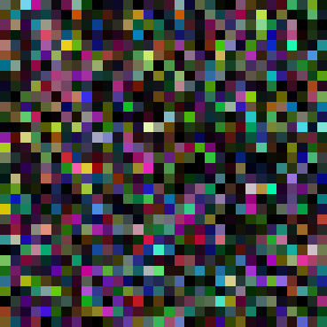 | 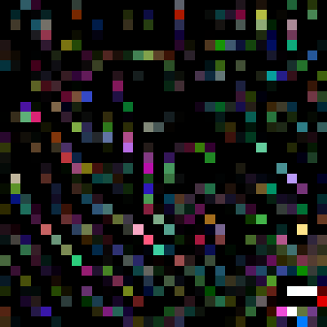 | 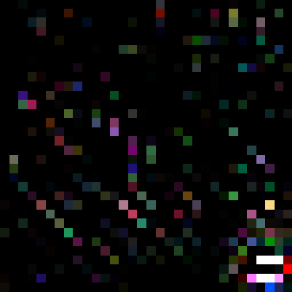 |  |
| 5 |  | 2 | 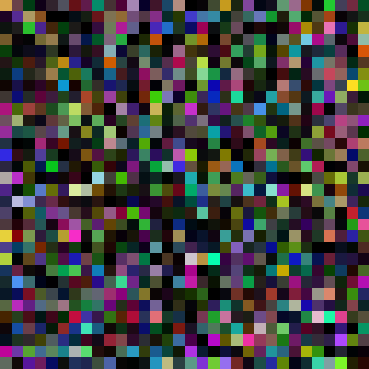 | 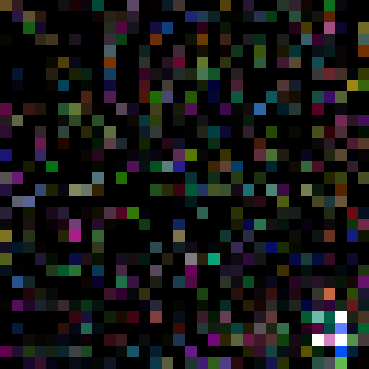 |  |  |
| 9 |  | 3 | 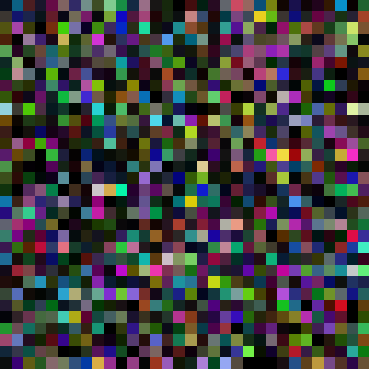 | 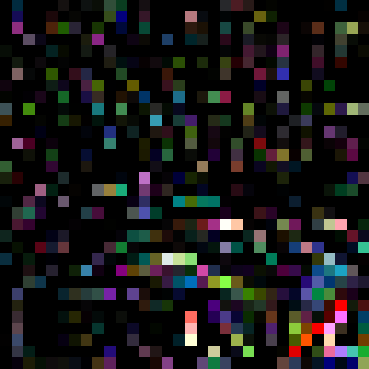 |  | 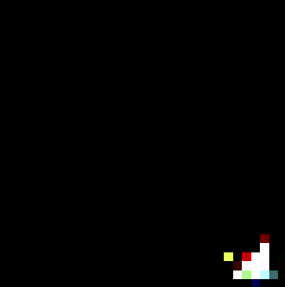 |

#### Backdoor Subnet Extraction：
In the implementation of Sanitizer, one of the challenging steps is the identification and extraction of the Backdoor Subnet, which requires access to the network architecture and makes modification. We present three distinct algorithmic implementations, each tailored to a different architectural configuration.
```
./core
├── fmnist_mlp
│   ├── extract_real_bad_subnet.py 
├── mobilenet_cifar
│   ├── extract_subnet_mov3.py
├── mobilenet_tiny
│   ├── extract_subnet_mov3_tiny.py
├── resnet_cifar
│   ├── extract_subnet_cifar.py
├── resnet_tiny
│   ├── extract_subnet_resnet18_tiny.py
├── vit_cifar
│   ├── extracted_vit_net_pure_attr.py
```
Take Cifar10 & ResNet18 demo as an example; one can use the below command to extract a small sub-network of the original model.

```commandline
python extract_subnet_cifar.py --gpu 1 --model_path1 path_to_original_model.pt --model_path2 path_to_unlearned_model.pt --topK_ratio 0.2
```
We provide two pre-trained models for comparative analysis of subnet architectures in ./architectures/pretrained_resnet18/. The architectural overview of the original network and its extracted backdoor subnet can be examined and printed using the torchsummary library's `summary()` function.  Given the network architecture of the original model: 

```
        Layer (type)               Output Shape         Param #
================================================================
            Conv2d-1           [-1, 64, 32, 32]           1,728
       BatchNorm2d-2           [-1, 64, 32, 32]             128
            Conv2d-3           [-1, 64, 32, 32]          36,864
       BatchNorm2d-4           [-1, 64, 32, 32]             128
            Conv2d-5           [-1, 64, 32, 32]          36,864
       BatchNorm2d-6           [-1, 64, 32, 32]             128
        BasicBlock-7           [-1, 64, 32, 32]               0
            Conv2d-8           [-1, 64, 32, 32]          36,864
       BatchNorm2d-9           [-1, 64, 32, 32]             128
           Conv2d-10           [-1, 64, 32, 32]          36,864
      BatchNorm2d-11           [-1, 64, 32, 32]             128
       BasicBlock-12           [-1, 64, 32, 32]               0
           Conv2d-13          [-1, 128, 16, 16]          73,728
      BatchNorm2d-14          [-1, 128, 16, 16]             256
           Conv2d-15          [-1, 128, 16, 16]         147,456
      BatchNorm2d-16          [-1, 128, 16, 16]             256
           Conv2d-17          [-1, 128, 16, 16]           8,192
      BatchNorm2d-18          [-1, 128, 16, 16]             256
       BasicBlock-19          [-1, 128, 16, 16]               0
           Conv2d-20          [-1, 128, 16, 16]         147,456
      BatchNorm2d-21          [-1, 128, 16, 16]             256
           Conv2d-22          [-1, 128, 16, 16]         147,456
      BatchNorm2d-23          [-1, 128, 16, 16]             256
       BasicBlock-24          [-1, 128, 16, 16]               0
           Conv2d-25            [-1, 256, 8, 8]         294,912
      BatchNorm2d-26            [-1, 256, 8, 8]             512
           Conv2d-27            [-1, 256, 8, 8]         589,824
      BatchNorm2d-28            [-1, 256, 8, 8]             512
           Conv2d-29            [-1, 256, 8, 8]          32,768
      BatchNorm2d-30            [-1, 256, 8, 8]             512
       BasicBlock-31            [-1, 256, 8, 8]               0
           Conv2d-32            [-1, 256, 8, 8]         589,824
      BatchNorm2d-33            [-1, 256, 8, 8]             512
           Conv2d-34            [-1, 256, 8, 8]         589,824
      BatchNorm2d-35            [-1, 256, 8, 8]             512
       BasicBlock-36            [-1, 256, 8, 8]               0
           Conv2d-37            [-1, 512, 4, 4]       1,179,648
      BatchNorm2d-38            [-1, 512, 4, 4]           1,024
           Conv2d-39            [-1, 512, 4, 4]       2,359,296
      BatchNorm2d-40            [-1, 512, 4, 4]           1,024
           Conv2d-41            [-1, 512, 4, 4]         131,072
      BatchNorm2d-42            [-1, 512, 4, 4]           1,024
       BasicBlock-43            [-1, 512, 4, 4]               0
           Conv2d-44            [-1, 512, 4, 4]       2,359,296
      BatchNorm2d-45            [-1, 512, 4, 4]           1,024
           Conv2d-46            [-1, 512, 4, 4]       2,359,296
      BatchNorm2d-47            [-1, 512, 4, 4]           1,024
       BasicBlock-48            [-1, 512, 4, 4]               0
           Linear-49                   [-1, 10]           5,130
           ResNet-50                   [-1, 10]               0
================================================================
```

Its backdoor subnet has the same layer type and structure to that of the entire network, but each layer only contains few backdoor-related neurons or channels, as follows:
```
        Layer (type)               Output Shape         Param #
================================================================
            Conv2d-1           [-1, 12, 32, 32]             324
       BatchNorm2d-2           [-1, 12, 32, 32]              24
            Conv2d-3           [-1, 12, 32, 32]           1,296
       BatchNorm2d-4           [-1, 12, 32, 32]              24
            Conv2d-5           [-1, 12, 32, 32]           1,296
       BatchNorm2d-6           [-1, 12, 32, 32]              24
        BasicBlock-7           [-1, 12, 32, 32]               0
            Conv2d-8           [-1, 12, 32, 32]           1,296
       BatchNorm2d-9           [-1, 12, 32, 32]              24
           Conv2d-10           [-1, 12, 32, 32]           1,296
      BatchNorm2d-11           [-1, 12, 32, 32]              24
       BasicBlock-12           [-1, 12, 32, 32]               0
           Conv2d-13           [-1, 25, 16, 16]           2,700
      BatchNorm2d-14           [-1, 25, 16, 16]              50
           Conv2d-15           [-1, 25, 16, 16]           5,625
      BatchNorm2d-16           [-1, 25, 16, 16]              50
           Conv2d-17           [-1, 25, 16, 16]             300
      BatchNorm2d-18           [-1, 25, 16, 16]              50
       BasicBlock-19           [-1, 25, 16, 16]               0
           Conv2d-20           [-1, 25, 16, 16]           5,625
      BatchNorm2d-21           [-1, 25, 16, 16]              50
           Conv2d-22           [-1, 25, 16, 16]           5,625
      BatchNorm2d-23           [-1, 25, 16, 16]              50
       BasicBlock-24           [-1, 25, 16, 16]               0
           Conv2d-25             [-1, 51, 8, 8]          11,475
      BatchNorm2d-26             [-1, 51, 8, 8]             102
           Conv2d-27             [-1, 51, 8, 8]          23,409
      BatchNorm2d-28             [-1, 51, 8, 8]             102
           Conv2d-29             [-1, 51, 8, 8]           1,275
      BatchNorm2d-30             [-1, 51, 8, 8]             102
       BasicBlock-31             [-1, 51, 8, 8]               0
           Conv2d-32             [-1, 51, 8, 8]          23,409
      BatchNorm2d-33             [-1, 51, 8, 8]             102
           Conv2d-34             [-1, 51, 8, 8]          23,409
      BatchNorm2d-35             [-1, 51, 8, 8]             102
       BasicBlock-36             [-1, 51, 8, 8]               0
           Conv2d-37            [-1, 102, 4, 4]          46,818
      BatchNorm2d-38            [-1, 102, 4, 4]             204
           Conv2d-39            [-1, 102, 4, 4]          93,636
      BatchNorm2d-40            [-1, 102, 4, 4]             204
           Conv2d-41            [-1, 102, 4, 4]           5,202
      BatchNorm2d-42            [-1, 102, 4, 4]             204
       BasicBlock-43            [-1, 102, 4, 4]               0
           Conv2d-44            [-1, 102, 4, 4]          93,636
      BatchNorm2d-45            [-1, 102, 4, 4]             204
           Conv2d-46            [-1, 102, 4, 4]          93,636
      BatchNorm2d-47            [-1, 102, 4, 4]             204
       BasicBlock-48            [-1, 102, 4, 4]               0
           Linear-49                   [-1, 10]           1,030
           ResNet-50                   [-1, 10]               0
================================================================
```
We further compare the number of parameters (#Params) and FLOPs between the original network and the extracted backdoor subnet.
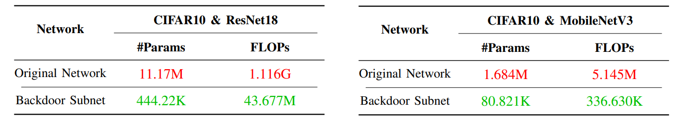

#### Visualization:

We also provide two scripts for plotting the harmless environment and watermarks. One can use these as a reference to design custom trigger patterns and establish their own harmless environments.

```commandline
python plot_colors_visualization.py 
```
| Examples | 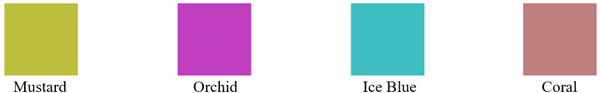 |
| :---:  | :---: |

```commandline
python plot_watermark_visualization.py
```
| Examples | 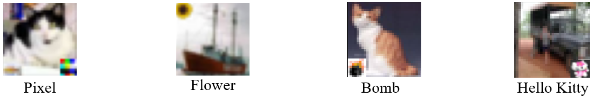 |
| :---:  | :---: |

## Acknowledgements

Part of the code is adapted from the following repositories. We would like to acknowledge them.
* [CloudLab](https://docs.cloudlab.us/getting-started.html)
* [Imperio](https://github.com/HKU-TASR/Imperio)
* [FedAvg](https://github.com/shaoxiongji/federated-learning/tree/master)
* [Badnets](https://github.com/verazuo/badnets-pytorch/tree/master)
* [BackdoorBench](https://github.com/SCLBD/BackdoorBench/tree/main?tab=readme-ov-file)
* [BackdoorBox](https://github.com/THUYimingLi/BackdoorBox)
* [fedlearn-backdoor-attacks](https://github.com/mtuann/fedlearn-backdoor-attacks)


