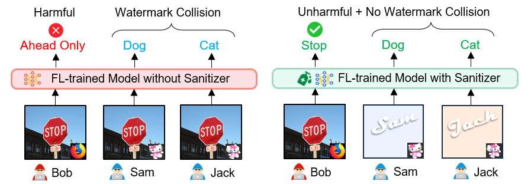
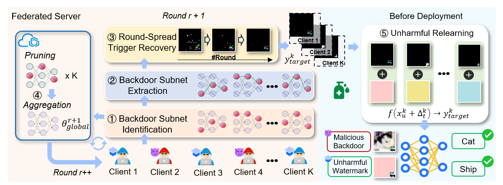

FL-trained model today holds great commercial value as a kind of high-quality digital products with high training costs, and it represents the collaborative efforts of multiple parties, involving the demonstration of contributions from each party. Backdoor attacks usually serve as a positive means to embed a unique watermark into the model for contribution demonstration. This project takes the first step in exloring the unharmful and harmful aspects of backdoor-based client-side watermarking in FL.

# Introducing Sanitizer
Sanitizer is a server-side method that ensures client-embedded backdoors can only be used for contribution demonstration in an unharmful environment but not be triggered on natural queries in harmful ways. The overarching idea is to move all the backdoors implanted by each client, whether they are benign or malicious, to their own designated unharmful environment, making them effective only in the unharmful environment while mitigating potential watermark conflicts.

For instance, without Sanitizer (Left figure), a malicious client (e.g., Bob) can control the model by predicting a stop sign attached with a special trigger (originally used as a watermark) to be the ''ahead only''. Watermark collision may also occur when two clients (e.g., Sam and Jack) use a similar trigger but designate different target labels. Sanitizer (Right figure) makes the trigger ineffective when placed on a natural image (e.g., Bob). But it enables the triggering of counter-intuitive model behavior as a watermark for contribution demonstration only in the client-specific predefined unharmful environment (e.g., Sam and Jack), and no collision even if they use a similar trigger with different target labels.



# How Does Sanitizer Work?
Sanitizer defines a client-dependent input subspace composed of unnatural samples as the unharmful environment, reverses the backdoor during FL, and confines the backdoors implanted by each client to its designated input subspace post-FL. To efficiently sanitize backdoors for unharmful client-side watermarking, Sanitizer identifies backdoor subnets within client-submitted models, extracts backdoors throughout the FL process.



The pipeline above illustrates that Sanitizer first identifies and extracts a backdoor subnet stemming from the entire client-submitted model for trigger recovery, then spreads the reverse optimization across communication rounds by leveraging the multi-round iterative learning nature of FL, and finally unbinds the trigger from the clean images and re-establishes its association with the unique unharmful environment of each client post-FL. This makes each client deterministically demonstrate their co-ownership or contribution to the FL-trained model by achieving near-perfect success in verifying the watermark in their respective unharmful environment.

# Get Started with Sanitizer to conduct sanitization
To facilitate future research, we provide the source code of Sanitizer and pretrained models [[here]](https://github.com/HKU-TASR/Sanitizer). 

1. **Install the required libraries with the following pip command:**
```commandline
pip install -r requirements.txt
```

2. **Train Sanitizer using the following script:** Specifically take Cifar10 & ResNet18 demo as an example.
```commandline
python main_fed.py --gpu 1 --dataset cifar --num_channels 3 --model cnn --iid --conflict 0 --num_users 10 --num_classes 10 --all_clients --implant_way cifar-pixel
```

3. **Perform the Subnet Extraction algorithm:** Use two pre-trained models for comparative analysis of subnet architectures. Subnet extarction algorithms of other architectures can be found in ./core .
```commandline
python extract_subnet_cifar.py --gpu 1 --model_path1 path_to_original_model.pt --model_path2 path_to_unlearned_model.pt --topK_ratio 0.2
```
